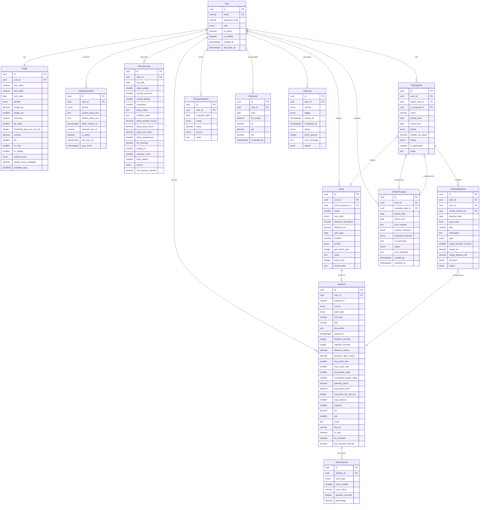

# Training Platform — Концептуальная модель данных

## Сущности

| Сущность           | Описание                                                        |
|--------------------|-----------------------------------------------------------------|
| `User`             | Учётная запись, аутентификация                                  |
| `Profile`          | Атлетический профиль, фитнес-метрики, настройки                |
| `IntegrationToken` | OAuth токены к внешним сервисам (Garmin, Strava, Whoop...)      |
| `Workout`          | Выполненная тренировка (факт)                                   |
| `WorkoutZone`      | Время в зонах ЧСС/мощности для тренировки                      |
| `RecoveryLog`      | Ежедневный дневник восстановления (1 запись на пользователя/день)|
| `Race`             | Целевое соревнование/гонка                                      |
| `TrainingPlan`     | Тренировочный план на период                                    |
| `PlannedWorkout`   | Плановая тренировка внутри плана                                |
| `AiPlanProposal`   | Предложение ИИ-агента (до согласования пользователем)           |
| `FitnessSnapshot`  | История ключевых метрик (FTP, VO2max, вес...)                   |
| `DailyLoad`        | Рассчитанные CTL/ATL/TSB за каждый день (кэш/материализация)   |
| `SyncLog`          | История синхронизаций с внешними сервисами                      |

---

## ER-диаграмма



---

## Детальное описание сущностей

---

### User — Учётная запись

| Поле           | Тип               | Описание                              |
|----------------|-------------------|---------------------------------------|
| `id`           | UUID PK           | Первичный ключ                        |
| `email`        | VARCHAR(255) UNIQUE| Email (логин)                        |
| `password_hash`| VARCHAR           | Bcrypt хэш пароля                     |
| `role`         | ENUM              | `athlete` / `admin` / `coach`         |
| `is_active`    | BOOLEAN           | Аккаунт активен                       |
| `is_verified`  | BOOLEAN           | Email подтверждён                     |
| `created_at`   | TIMESTAMPTZ       |                                       |
| `last_login_at`| TIMESTAMPTZ       |                                       |

---

### Profile — Атлетический профиль

| Поле                          | Тип          | Описание                                  |
|-------------------------------|--------------|-------------------------------------------|
| `user_id`                     | UUID FK      | 1:1 к User                                |
| `first_name`, `last_name`     | VARCHAR      |                                           |
| `birth_date`                  | DATE         |                                           |
| `gender`                      | ENUM         | `male` / `female` / `other`               |
| `weight_kg`                   | DECIMAL(5,2) |                                           |
| `height_cm`                   | SMALLINT     |                                           |
| `timezone`                    | VARCHAR(50)  | Часовой пояс (для отображения дат)        |
| `ftp_watts`                   | SMALLINT     | Функциональная пороговая мощность         |
| `threshold_pace_sec_per_km`   | INTEGER      | Пороговый темп бега (сек/км)              |
| `vo2max`                      | DECIMAL(5,2) |                                           |
| `lthr`                        | SMALLINT     | Пороговая ЧСС                             |
| `hr_max`                      | SMALLINT     | Максимальная ЧСС                          |
| `hr_resting`                  | SMALLINT     | ЧСС покоя                                 |
| `training_level`              | ENUM         | `beginner` / `amateur` / `advanced` / `elite` |
| `weekly_hours_available`      | DECIMAL(4,1) | Часов в неделю на тренировки              |
| `available_days`              | SMALLINT[]   | Дни недели (1=Пн, 7=Вс)                  |

---

### IntegrationToken — OAuth токены сервисов

| Поле                | Тип          | Описание                                  |
|---------------------|--------------|-------------------------------------------|
| `service`           | ENUM         | `garmin` / `strava` / `whoop` / `polar` / `wahoo` / `oura` |
| `access_token_enc`  | TEXT         | Access token (зашифрован AES-256)         |
| `refresh_token_enc` | TEXT         | Refresh token (зашифрован)                |
| `token_expires_at`  | TIMESTAMPTZ  |                                           |
| `external_user_id`  | VARCHAR(100) | ID пользователя в сервисе                 |
| `is_active`         | BOOLEAN      |                                           |
| `last_sync_at`      | TIMESTAMPTZ  | Время последней синхронизации             |
| `sync_since`        | TIMESTAMPTZ  | Импортировать данные начиная с этой даты  |

**Ограничение**: `UNIQUE(user_id, service)` — один аккаунт на сервис

---

### Workout — Выполненная тренировка

| Поле                    | Тип           | Описание                                    |
|-------------------------|---------------|---------------------------------------------|
| `external_id`           | VARCHAR(200)  | ID в Strava/Garmin (для идемпотентности)    |
| `source`                | ENUM          | `manual` / `strava` / `garmin` / `whoop` / `polar` |
| `sport_type`            | ENUM          | `run` / `cycling` / `swimming` / `triathlon` / `ocr` / `strength` / `other` |
| `sub_type`              | VARCHAR(50)   | `road`, `trail`, `mtb`, `indoor`, `open_water`... |
| `started_at`            | TIMESTAMPTZ   | Начало тренировки                           |
| `duration_seconds`      | INTEGER       | Активное время (без пауз)                   |
| `elapsed_seconds`       | INTEGER       | Полное время (с паузами)                    |
| `distance_meters`       | DECIMAL(10,2) |                                             |
| `elevation_gain_meters` | DECIMAL(8,1)  |                                             |
| `avg_heart_rate`        | SMALLINT      |                                             |
| `max_heart_rate`        | SMALLINT      |                                             |
| `avg_power_watts`       | SMALLINT      | Средняя мощность (велосипед)                |
| `normalized_power_watts`| SMALLINT      | Нормализованная мощность                    |
| `intensity_factor`      | DECIMAL(4,3)  | IF = NP / FTP                               |
| `tss`                   | DECIMAL(6,1)  | Training Stress Score                       |
| `avg_pace_sec_per_km`   | INTEGER       | Средний темп (бег)                          |
| `avg_speed_kmh`         | DECIMAL(6,3)  |                                             |
| `avg_cadence`           | SMALLINT      |                                             |
| `calories`              | SMALLINT      |                                             |
| `rpe`                   | SMALLINT      | Субъективная нагрузка (1-10)                |
| `notes`                 | TEXT          |                                             |
| `file_url`              | VARCHAR(500)  | Ссылка на GPX/FIT файл                      |
| `is_race`               | BOOLEAN       | Тренировка является гонкой                  |
| `is_excluded`           | BOOLEAN       | Исключить из расчёта TSS (болезнь и т.д.)   |
| `has_manual_override`   | BOOLEAN       | Хотя бы одно поле отредактировано вручную   |

**Ограничение**: `UNIQUE(user_id, external_id, source)` — защита от дублей

---

### WorkoutZone — Зоны ЧСС/мощности

| Поле               | Тип          | Описание                                  |
|--------------------|--------------|-------------------------------------------|
| `workout_id`       | UUID FK      |                                           |
| `zone_type`        | ENUM         | `heart_rate` / `power`                    |
| `zone_number`      | SMALLINT     | 1–7                                       |
| `zone_name`        | VARCHAR(50)  | "Z1 Recovery", "Z4 Threshold"...          |
| `duration_seconds` | INTEGER      |                                           |
| `percentage`       | DECIMAL(5,2) | % от общего времени                       |

---

### RecoveryLog — Дневник восстановления

Одна запись на пользователя в день. Содержит **субъективные** (вводит пользователь) и **объективные** (из устройств) данные.

| Поле                  | Тип          | Источник   | Описание                              |
|-----------------------|--------------|------------|---------------------------------------|
| `log_date`            | DATE         |            | `UNIQUE(user_id, log_date)`           |
| `sleep_quality`       | SMALLINT 1-5 | Вручную    | Субъективное качество сна             |
| `muscle_soreness`     | SMALLINT 1-5 | Вручную    | 1=свежий, 5=очень болит               |
| `overall_feeling`     | SMALLINT 1-5 | Вручную    |                                       |
| `motivation`          | SMALLINT 1-5 | Вручную    |                                       |
| `injury_notes`        | TEXT         | Вручную    | Заметки о травмах/болях               |
| `nutrition_notes`     | TEXT         | Вручную    |                                       |
| `sleep_duration_hours`| DECIMAL(4,2) | Устройство | Фактическая длительность сна          |
| `sleep_deep_hours`    | DECIMAL(4,2) | Устройство | Глубокий сон                          |
| `sleep_rem_hours`     | DECIMAL(4,2) | Устройство | REM-сон                               |
| `sleep_awakenings`    | SMALLINT     | Устройство | Количество пробуждений                |
| `hrv_morning`         | DECIMAL(6,2) | Устройство | Утренний HRV (RMSSD, мс)              |
| `resting_hr`          | SMALLINT     | Устройство | ЧСС покоя                             |
| `recovery_score`      | SMALLINT     | Устройство | 0-100 (Whoop / Oura / Garmin)         |
| `body_battery`        | SMALLINT     | Устройство | 0-100 (Garmin)                        |
| `has_manual_override` | BOOLEAN      |            | Поля изменены вручную поверх данных устройства |

---

### Race — Целевая гонка/соревнование

| Поле                   | Тип          | Описание                                     |
|------------------------|--------------|----------------------------------------------|
| `name`                 | VARCHAR(255) | Название гонки                               |
| `race_type`            | ENUM         | `run` / `cycling` / `triathlon` / `ocr` / `duathlon` / `other` |
| `distance_description` | VARCHAR(100) | "Spartan Sprint", "42.2km", "Olympic"        |
| `distance_km`          | DECIMAL(7,3) | Может быть NULL для OCR                      |
| `race_date`            | DATE         |                                              |
| `location`             | VARCHAR(255) |                                              |
| `priority`             | ENUM         | `A` (пик сезона) / `B` (подводящая) / `C` (тренировочная) |
| `goal_finish_time`     | INTEGER      | Целевое время финиша (секунды)               |
| `actual_workout_id`    | UUID FK      | Привязанная тренировка после гонки           |
| `result_time`          | INTEGER      | Фактическое время финиша (секунды)           |
| `result_notes`         | TEXT         |                                              |

---

### TrainingPlan — Тренировочный план

| Поле                | Тип          | Описание                                     |
|---------------------|--------------|----------------------------------------------|
| `name`              | VARCHAR(255) |                                              |
| `period_start`      | DATE         |                                              |
| `period_end`        | DATE         |                                              |
| `phase`             | ENUM         | `base` / `build` / `peak` / `race` / `recovery` / `transition` |
| `target_race_id`    | UUID FK      | Целевая гонка (опционально)                  |
| `weekly_tss_target` | DECIMAL(6,1) | Целевой недельный TSS                        |
| `status`            | ENUM         | `draft` / `active` / `completed` / `archived`|
| `ai_generated`      | BOOLEAN      | Создан ИИ-агентом                            |
| `ai_proposal_id`    | UUID FK      | Ссылка на предложение агента                 |

---

### PlannedWorkout — Плановая тренировка

| Поле                     | Тип          | Описание                                  |
|--------------------------|--------------|-------------------------------------------|
| `plan_id`                | UUID FK      | Принадлежит плану                         |
| `user_id`                | UUID FK      | Денормализовано для быстрых запросов      |
| `planned_date`           | DATE         |                                           |
| `sport_type`             | ENUM         | `run` / `cycling` / `swimming` / `rest`...|
| `goal`                   | ENUM         | `recovery` / `endurance` / `tempo` / `threshold` / `vo2max` / `strength` / `long_run` / `race_simulation` |
| `target_duration_minutes`| SMALLINT     |                                           |
| `target_tss`             | DECIMAL(5,1) |                                           |
| `target_distance_km`     | DECIMAL(7,3) |                                           |
| `structure`              | JSONB        | Детали тренировки (разминка, интервалы...) |
| `status`                 | ENUM         | `planned` / `completed` / `skipped` / `modified` |
| `actual_workout_id`      | UUID FK      | Привязывается после выполнения            |

**Пример `structure` JSONB:**
```json
{
  "blocks": [
    { "type": "warmup", "duration_min": 15, "zone": "Z1-Z2" },
    { "type": "intervals", "sets": 5, "work_min": 4, "rest_min": 2, "zone": "Z4-Z5" },
    { "type": "cooldown", "duration_min": 10, "zone": "Z1" }
  ]
}
```

---

### AiPlanProposal — Предложение ИИ-агента

| Поле                | Тип          | Описание                                     |
|---------------------|--------------|----------------------------------------------|
| `period_start`      | DATE         | Период планирования                          |
| `period_end`        | DATE         |                                              |
| `user_request`      | TEXT         | Запрос/комментарий пользователя              |
| `context_snapshot`  | JSONB        | Снимок данных, переданных агенту (аудит)     |
| `proposal_workouts` | JSONB        | Структурированный план от агента             |
| `ai_reasoning`      | TEXT         | Обоснование плана от агента                  |
| `status`            | ENUM         | `pending` / `accepted` / `rejected` / `expired` |
| `user_feedback`     | TEXT         | Причина отклонения                           |
| `accepted_plan_id`  | UUID FK      | Ссылка на план после принятия                |

---

### FitnessSnapshot — История метрик

Позволяет отслеживать прогресс FTP, VO2max, веса и других ключевых показателей.

| Поле            | Тип          | Описание                                     |
|-----------------|--------------|----------------------------------------------|
| `snapshot_date` | DATE         |                                              |
| `metric`        | ENUM         | `ftp_watts` / `vo2max` / `threshold_pace` / `lthr` / `hr_max` / `hr_resting` / `weight_kg` |
| `value`         | DECIMAL(8,3) |                                              |
| `source`        | ENUM         | `manual` / `field_test` / `estimated`        |
| `notes`         | TEXT         |                                              |

---

### DailyLoad — Ежедневная нагрузка (кэш)

Предрассчитанные значения CTL/ATL/TSB. Пересчитываются при добавлении/изменении тренировки.

| Поле          | Тип          | Описание                                     |
|---------------|--------------|----------------------------------------------|
| `date`        | DATE         | `UNIQUE(user_id, date)`                      |
| `tss_actual`  | DECIMAL(6,1) | Фактический TSS за день                      |
| `ctl`         | DECIMAL(6,2) | Chronic Training Load (42-дневный)           |
| `atl`         | DECIMAL(6,2) | Acute Training Load (7-дневный)              |
| `tsb`         | DECIMAL(6,2) | Training Stress Balance = CTL - ATL          |
| `computed_at` | TIMESTAMPTZ  | Время последнего пересчёта                   |

**Формулы:**
```
CTL(d) = CTL(d-1) × exp(-1/42) + TSS(d) × (1 - exp(-1/42))
ATL(d) = ATL(d-1) × exp(-1/7)  + TSS(d) × (1 - exp(-1/7))
TSB(d) = CTL(d-1) - ATL(d-1)   ← значение на начало дня
```

---

### SyncLog — История синхронизаций

| Поле            | Тип          | Описание                                     |
|-----------------|--------------|----------------------------------------------|
| `service`       | ENUM         | Какой сервис синхронизировался               |
| `trigger`       | ENUM         | `webhook` / `scheduled` / `manual`           |
| `started_at`    | TIMESTAMPTZ  |                                              |
| `completed_at`  | TIMESTAMPTZ  |                                              |
| `status`        | ENUM         | `running` / `success` / `partial` / `failed` |
| `items_synced`  | INTEGER      | Количество импортированных записей           |
| `error_message` | TEXT         |                                              |
| `details`       | JSONB        | Детали ошибок по конкретным записям          |

---

## Ключевые индексы

```sql
-- Частые запросы по пользователю + дате
CREATE INDEX idx_workout_user_date     ON workout(user_id, started_at DESC);
CREATE INDEX idx_recovery_user_date    ON recovery_log(user_id, log_date DESC);
CREATE INDEX idx_daily_load_user_date  ON daily_load(user_id, date DESC);
CREATE INDEX idx_planned_workout_date  ON planned_workout(user_id, planned_date);
CREATE INDEX idx_fitness_snapshot_user ON fitness_snapshot(user_id, metric, snapshot_date DESC);

-- Дедупликация импорта
CREATE UNIQUE INDEX idx_workout_external ON workout(user_id, external_id, source)
  WHERE external_id IS NOT NULL;

-- Один дневник в день
CREATE UNIQUE INDEX idx_recovery_unique ON recovery_log(user_id, log_date);
CREATE UNIQUE INDEX idx_daily_load_unique ON daily_load(user_id, date);
```

---

## Ключевые решения

### 1. DailyLoad как кэш, а не вычисление на лету
CTL/ATL/TSB зависят от всей истории тренировок — пересчитывать каждый раз дорого. Храним предрассчитанные значения, пересчитываем при изменении тренировок (фоновая задача Celery).

### 2. RecoveryLog — один на день
Объединяет субъективный дневник + данные с устройств в одну запись. Поле `has_manual_override` фиксирует факт ручной правки поверх данных устройства.

### 3. AiPlanProposal хранит context_snapshot
Снимок данных (CTL, ATL, HRV-тренд, история 8 недель), которые были переданы агенту — для отладки, аудита и понимания "почему агент предложил именно это".

### 4. PlannedWorkout.user_id — денормализация
Дублируется из TrainingPlan для эффективных запросов "все тренировки пользователя на эту неделю" без JOIN через plan.

### 5. Workout.is_excluded
Позволяет исключить тренировку из расчёта TSS/CTL/ATL, не удаляя её (болезнь, поломка оборудования, случайная запись).

### 6. FitnessSnapshot отдельно от Profile
Profile хранит текущие значения, FitnessSnapshot — историю изменений. Позволяет строить график "FTP за год".

### 7. IntegrationToken.sync_since
Позволяет контролировать глубину исторического импорта при первом подключении сервиса.
